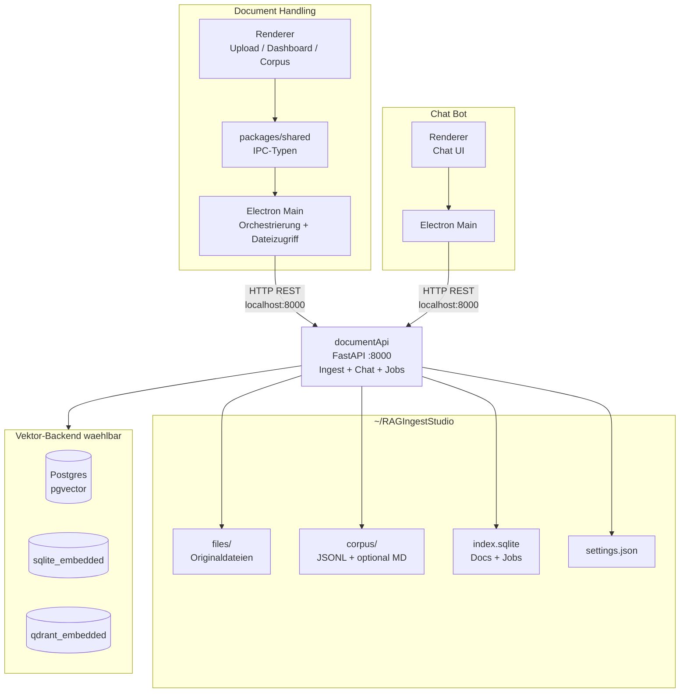
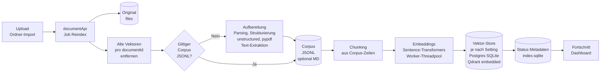

# RAG Ingest Studio + RAG Chat

Desktop-Stack (Electron + React + TypeScript + FastAPI) fuer lokale Dokument-Ingestion und Chat ueber Vektor-Retrieval:

- Upload per File Picker, Drag & Drop und rekursiver Ordner-Ingest
- **Aufbereitung vor der Indexierung:** Rohdatei wird geparst und strukturiert (u. a. `unstructured`, `pypdf`), daraus entsteht der editierbare **Corpus als JSONL**; erst danach folgen Embeddings und Schreiben in den Vektor-Store
- Lokale Embeddings im **documentApi**-Prozess (`app/worker.py`, Sentence-Transformers) ueber einen **Worker-Threadpool** — nicht als separater Subprozess im Standardpfad
- Vektor-Backends pro Umgebung:
  - `postgres` (pgvector)
  - `sqlite_embedded` (ohne separaten Server)
  - `qdrant_embedded` (lokaler Qdrant-Speicherordner, ohne separaten Server)
- Lokale Index-DB in SQLite (`index.sqlite`) fuer Dokument-/Job-Metadaten
- Editierbarer Corpus als JSONL (optional Markdown)
- Reindex pro Dokument, Bulk und "Alle neu indexieren"
- Chat-UI mit Quellenlinks (extern) und Antwort-Metriken (Dauer, Tokens, Tokens/s)

## Monorepo Struktur

```text
documentHandling/    Dokumentverwaltung + Ingestion UI (Electron + Vite)
  apps/main/         Electron Main — spricht per HTTP mit documentApi
  apps/renderer/     React UI
  apps/python_worker/ Optionaler Standalone-Worker (Legacy); Standardweg ist documentApi
  packages/shared/   IPC-Typen und gemeinsame Typen fuer die Handling-App
chatBot/             Chat UI (Electron); Main spricht ebenfalls per HTTP mit documentApi
documentApi/         FastAPI (:8000), IngestService, ChatService, Parsing, Embeddings, Vector Stores
scripts/             Startskripte (u. a. documentApi Runner mit documentApi/.venv)
```

## Systemdiagramm (Komponenten)

Zwei Electron-Apps teilen sich **dieselbe** FastAPI-Instanz und dieselbe Datenablage unter `~/RAGIngestStudio/`.



### Was dieses Diagramm zeigt

1. **Zwei Frontends, ein Backend** — Ingest-UI und Chat-App sprechen beide mit **documentApi**; Metadaten und Vektoren liegen konsolidiert vor.
2. **IPC nur in Document Handling** — Die Renderer-UI nutzt typisierte IPC-Aufrufe zum Main-Prozess; **kein** direkter Zugriff auf Python oder Vektor-DBs aus dem Renderer.
3. **Electron Main als lokaler Client** — Main bündelt Aktionen und ruft die REST-API auf (u. a. Upload, Jobs, Corpus, Settings). Die persistente Arbeit (Parsing, Queue, Embeddings) laeuft im **documentApi**-Prozess.
4. **Gemeinsame Artefakte** — Originaldateien, Corpus, SQLite-Index und Einstellungen liegen unter derselben Basis; das Backend liest/schreibt diese Pfade.

## Ingest-Pipeline mit Dokument-Aufbereitung

Vor Embeddings und Vektor-Speicherung werden Dokumente **aufbereitet**: Aus der Rohdatei werden strukturierte Text-Chunks erzeugt und als **Corpus (JSONL)** abgelegt — editierbar im UI, Grundlage fuer jeden Reindex.



### Schritte der Pipeline

1. **Import** — Datei landet unter `files/<docId>/`, Eintrag in `index.sqlite`, Job wird eingereiht.
2. **Bereinigung** — Vor Reindex werden Vektoreintraege des Dokuments im gewaehlten Backend entfernt (idempotent).
3. **Aufbereitung (wenn kein nutzbarer Corpus existiert)** — `parse_document` im **documentApi** extrahiert und normalisiert Inhalt; daraus werden JSONL-Zeilen mit Text und Metadaten gebaut und unter `corpus/` gespeichert (optional Markdown-Export).
4. **Bestehender Corpus** — Wurde der Text im Corpus Viewer geaendert, wird **ohne** erneutes Parsing der Datei aus JSONL weiterindexiert.
5. **Embeddings & Upsert** — Chunk-Texte werden im Threadpool eingebettet und in den konfigurierten Vektor-Store geschrieben.
6. **Rueckmeldung** — Job-Status und Chunk-Zaehlung in SQLite; SSE/Progress fuer die UI.

## Voraussetzungen

- Node.js 20+
- Python 3.10+ (fuer lokale Entwicklung: venv unter `documentApi/.venv`, siehe unten)
- Docker (optional, nur fuer Postgres/pgvector)

## 1) Postgres (pgvector) lokal starten

```bash
docker run --name rag-pg -e POSTGRES_PASSWORD=postgres -e POSTGRES_USER=postgres -e POSTGRES_DB=rag -p 5432:5432 -d pgvector/pgvector:pg16
```

Danach ist Postgres auf `localhost:5432` erreichbar.

## 2) documentApi Python-Umgebung einrichten

Im Verzeichnis `documentApi`:

```bash
python -m venv .venv
# Windows (PowerShell):
.venv\Scripts\Activate.ps1
# macOS/Linux:
source .venv/bin/activate
python -m pip install -r requirements.txt
```

Wichtig: Alle API-Abhaengigkeiten (z. B. `qdrant-client`, `sentence-transformers`) in genau dieser venv installieren:

```bash
documentApi\.venv\Scripts\python.exe -m pip install -r documentApi/requirements.txt
```

Das Startskript `npm run dev:api` erwartet `documentApi\.venv\Scripts\python.exe` (siehe `scripts/run-document-api.mjs`).

## 3) Node Dependencies installieren

Im Repository-Root:

```bash
npm install
```

## 4) Development starten

**Document Handling** (Ingest-App) — im Repository-Root:

```bash
npm run dev
```

Das startet:

- **documentApi** (FastAPI/Uvicorn) auf `http://127.0.0.1:8000`
- Vite Renderer auf `http://localhost:5173`
- Electron Main Process (startet erst, wenn Renderer **und** Port 8000 bereit sind)

Nur die API in einem eigenen Terminal: `npm run dev:api`

**Chat Bot** — separat, ebenfalls gegen dieselbe API:

```bash
npm run dev:chat
```

Hinweis zu `qdrant_embedded`: Der API-Runner startet standardmaessig **ohne** `uvicorn --reload`, da der Qdrant-Ordner exklusiv gelockt wird.  
Reload nur explizit aktivieren:

```bash
# PowerShell
$env:DOCUMENT_API_RELOAD="1"
npm run dev:api
```

## 5) Production Build

```bash
npm run build
```

## 6) Produktionsstart

```bash
npm run start
```

Das Skript baut zuerst Renderer + Main (Document Handling) und startet danach Electron im Production-Modus.

## Datenablage / Offline Verhalten

Alle Artefakte liegen lokal in:

`~/RAGIngestStudio/`

Unterstruktur:

- `files/<docId>/` - Originaldateien
- `corpus/<docId>.jsonl` - editierbare Source of Truth (nach Aufbereitung bzw. manueller Bearbeitung)
- `corpus/<docId>.md` - optionaler Markdown-Export
- `index.sqlite` - Dokumente + Jobs
- `settings.json` - lokale Einstellungen (inkl. Vektor-Backend pro Umgebung)
- `vector_sqlite/` - Speicher fuer `sqlite_embedded`
- `vector_qdrant/` - Speicher fuer `qdrant_embedded`

## Kern-Funktionen

- **Dashboard** mit Filter/Suche, Status, Chunk-Anzahl, Bulk-Aktionen
- **Upload** per Picker oder Drag & Drop
- **Corpus Viewer** (editierbar), Speichern + Reindex
- **Settings** pro Umgebung inkl. Backend-Auswahl (`postgres`, `sqlite_embedded`, `qdrant_embedded`)
- **Connection Test** backend-spezifisch (Postgres/SQLite/Qdrant)
- **CSV Export** der Dokumentliste
- **Chat** mit Quellenanzeige, "Website"-Button (externer Browser), Copy-Button und Antwort-Metriken

## Hinweise zu Idempotenz

- Vor jedem Reindex werden bestehende Vektoren fuer `documentId` im jeweiligen Vektor-Backend entfernt.
- Point IDs sind deterministisch via `sha256(documentId + ":" + chunkIndex)`.
- JSONL bleibt die editierbare Truth-Quelle fuer spaetere Reindex-Laeufe (wenn vorhanden, entfaellt erneutes Parsing der Originaldatei).
