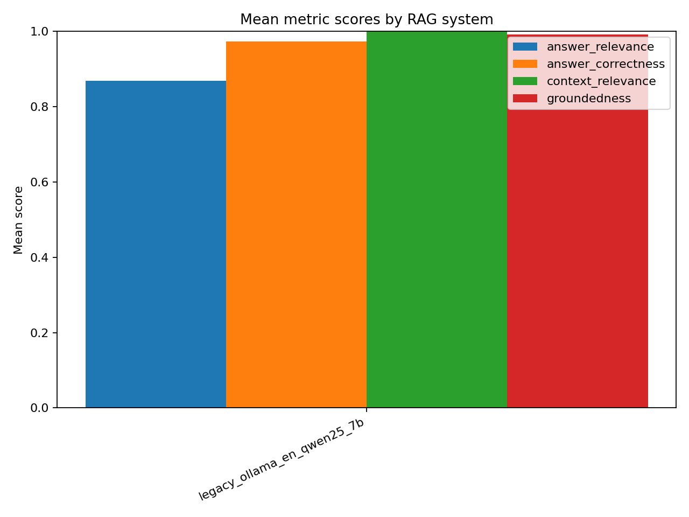

# run_rag_eval_from_ground_truth.py

This document explains how `scripts/evaluation/run_rag_eval_from_ground_truth.py` works and how to use it.

## What This Script Does

The script runs an end-to-end RAG evaluation pipeline:

1. Reads questions and reference answers from a ground-truth file.
2. Sends each question to your RAG API (`/api/chat`).
3. Saves generated answers and normalized ground truth to CSV.
4. Optionally runs `scripts/evaluation/evaluate_fragerunden.py` to score the answers.

## Supported Input Formats

Use `--ground-truth-file` with one of these formats:

- `.txt` or `.md` with lines like:
  - `Question: ... Answer: ...`
  - Numbering is allowed (for example `1 Question: ... Answer: ...`).
- `.csv`, `.jsonl`, `.xlsx`, `.xls` with question and ground-truth columns.

Accepted question column aliases:

- `question`
- `frage`
- `prompt`
- `objective fragen`

Accepted ground-truth column aliases:

- `ground_truth`
- `reference_answer`
- `gold_answer`
- `answer`
- `antwort`

## Prerequisites

- RAG API is running (default `http://127.0.0.1:8000`).
- Local LLM backend (for RAG answering) is running if your API depends on it (for example Ollama).
- Python env has required packages (`requests`, `pandas`, and dependencies of `evaluate_fragerunden.py`).

If you run evaluation (do not use `--skip-eval`), you also need a judge endpoint compatible with the OpenAI client.

## Basic Usage

Run full pipeline (generate + evaluate):

```bash
python scripts/evaluation/run_rag_eval_from_ground_truth.py \
  --ground-truth-file outputs/not_questions_ground_truth_input.txt \
  --api-base-url http://127.0.0.1:8000 \
  --system-version legacy_ollama_en_qwen25_7b \
  --outdir outputs/eval_run_not
```

Generate only (skip evaluator):

```bash
python scripts/evaluation/run_rag_eval_from_ground_truth.py \
  --ground-truth-file outputs/not_questions_ground_truth_input.txt \
  --api-base-url http://127.0.0.1:8000 \
  --outdir outputs/eval_run_not \
  --skip-eval
```

Limit to first N questions:

```bash
python scripts/evaluation/run_rag_eval_from_ground_truth.py \
  --ground-truth-file outputs/not_questions_ground_truth_input.txt \
  --outdir outputs/eval_run_not_quick \
  --limit 5
```

## Use a Local Judge (Ollama)

You can keep RAG answering local and also run the evaluator with a local judge endpoint.

Example with Ollama:

```bash
OPENAI_API_KEY=ollama python scripts/evaluation/run_rag_eval_from_ground_truth.py \
  --ground-truth-file outputs/not_questions_ground_truth_input.txt \
  --api-base-url http://127.0.0.1:8000 \
  --system-version legacy_ollama_en_qwen25_7b \
  --outdir outputs/eval_run_not_local_judge \
  --eval-base-url http://localhost:11434/v1 \
  --eval-model qwen2.5:7b-instruct
```

Notes:

- `evaluate_fragerunden.py` requires `OPENAI_API_KEY` to be set. For local judge endpoints, a placeholder value like `ollama` is fine.
- Local judge scores can differ from cloud judge scores.

## Output Files

The script creates these files in `--outdir`:

- `questions_ground_truth.csv`
  - Normalized question + reference answer table.
- `questions_qa.csv`
  - RAG outputs with columns: `system_version`, `question`, `answer`, `context`.

If evaluator runs (default):

- `fragerunden_eval_rows.csv`
  - Row-level metric results.
- `fragerunden_eval_by_system.csv`
  - Aggregated summary by system version.

## Visualization

After evaluation, generate charts with `scripts/evaluation/visualize_fragerunden_eval.py`:

```bash
python scripts/evaluation/visualize_fragerunden_eval.py \
  --rows outputs/eval_run_not_local_judge/fragerunden_eval_rows.csv \
  --summary outputs/eval_run_not_local_judge/fragerunden_eval_by_system.csv \
  --outdir outputs/eval_run_not_local_judge
```

The visualization script writes:

- `fragerunden_heatmap_answer_relevance.png`
- `fragerunden_heatmap_answer_correctness.png`
- `fragerunden_system_means.png`
- `fragerunden_per_question_best_system.csv`

Example images from the latest local-judge run:

### Answer Relevance Heatmap


### Answer Correctness Heatmap


### System Means



## Key CLI Arguments

- `--ground-truth-file` (required): Input file path.
- `--api-base-url`: RAG API base URL.
- `--language`: `en`, `de`, or empty string to omit language.
- `--system-version`: Label stored in generated QA rows.
- `--outdir`: Output directory.
- `--timeout-sec`: Timeout per `/api/chat` request.
- `--limit`: Use first N questions only.
- `--skip-eval`: Do not run evaluator.
- `--eval-base-url`: Judge API base URL passed to evaluator.
- `--eval-model`: Judge model name passed to evaluator.
- `--eval-temperature`: Judge temperature passed to evaluator.

## Troubleshooting

### "Could not parse any Question/Answer pairs"

Your `.txt/.md` file must contain `Question:` and `Answer:` pairs on each item.

### "OPENAI_API_KEY is required for evaluation"

Set `OPENAI_API_KEY` before running when evaluator is enabled.

- Cloud judge: use your real key.
- Local judge: set a placeholder, for example `OPENAI_API_KEY=ollama`.

### RAG request failures in `questions_qa.csv`

Check:

- RAG API is reachable at `--api-base-url`.
- LLM backend used by your API is running.
- `--timeout-sec` is high enough for slow responses.

## Related Scripts

- `scripts/evaluation/run_rag_eval_from_ground_truth.py`
- `scripts/evaluation/evaluate_fragerunden.py`

Compatibility note:

- Wrapper launchers remain at the old `scripts/*.py` paths, so existing commands continue to work.
